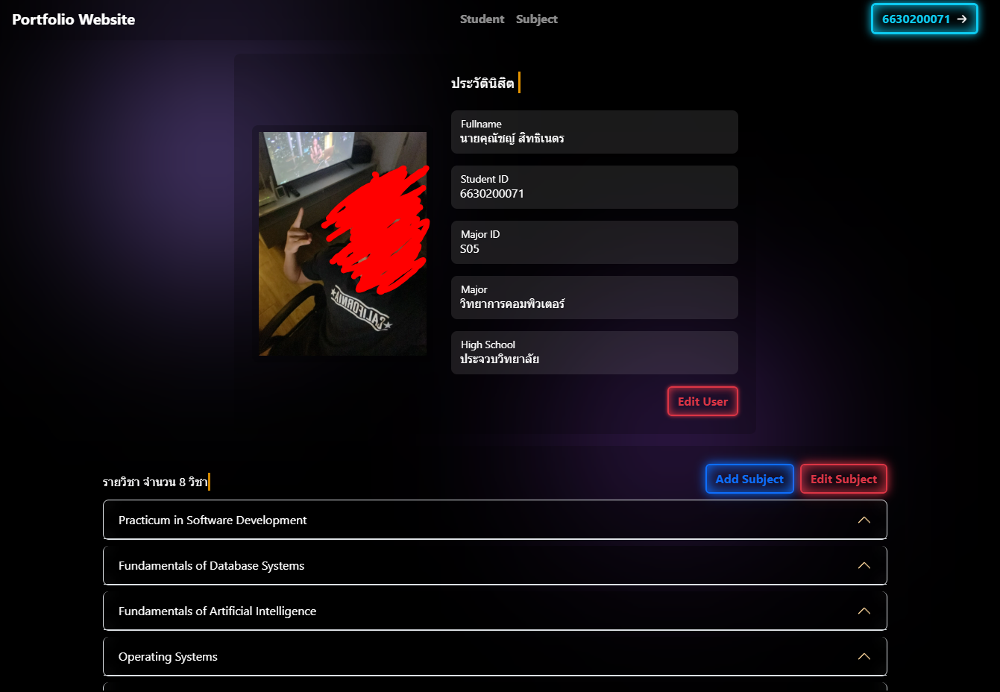

# 🖥️ Project - Portfolio Website with Vue 3

> Project เว็บไซต์แนะนำตัวและรายวิชา ด้วย Vue 3

## 🛠️ Features
- **การจัดการข้อมูลแบบ CRUD**:
  - **Create**: ผู้ใช้สามารถเพิ่มรายวิชาลงในระบบได้
  - **Read**: ผู้ใช้สามารถดูข้อมูลส่วนตัวและรายวิชาที่มีอยู่ในระบบได้
  - **Update**: ผู้ใช้สามารถแก้ไขข้อมูลส่วนตัวและรายวิชาที่มีอยู่ในระบบ
  - **Delete**: ผู้ใช้สามารถลบข้อมูลรายวิชาที่ไม่ต้องการออกจากระบบได้

- **การใช้ JSON Server**: ข้อมูลทั้งหมดจะถูกเก็บในไฟล์ `db.json` และสามารถเข้าถึงได้ผ่าน API ของ json-server

## 🚀 Screenshots

<p align="center">
  
</p>

## 📜 License

This project is open-source under the MIT License. Let me know if you need any modifications! 🚀

## 🗺️ Project Structure

```bash
project214_6630200071/
├── LICENSE               # Contains the project’s license (MIT License)
├── README.md             # Documentation file explaining how to use the project
├── images/                 
|   └── website.png       
├── data/                 
|   └── db.json           # data storage for the system
├── public/               
|   └── favorite.ico      # Favicon for the project
├── src/                  
|   ├── assets/           
|   |   ├── images/           
|   |   |   ├── img1.webp     # Image 1 in .webp format
|   |   |   └── img2.webp     # Image 2 in .webp format
|   |   ├── logo.svg          # Logo in SVG format
|   |   ├── logo.webp         # Logo in .webp format
|   |   ├── main.css          # Main CSS file for global styling
|   |   └── style.css         # Additional styles or overrides
|   ├── components/       
|   |   ├── Header.vue        # Header component
|   |   ├── Modal.vue         # Modal component for dialogs
|   |   ├── ShowAlert.vue     # Alert component to display messages
|   |   ├── ShowStudent.vue   # Component to show student details
|   |   └── ShowSubject.vue   # Component to show subject details
|   ├── stores/           
|   |   ├── subjects.ts       # Store for managing subjects data
|   |   └── user.ts           # Store for managing user data
|   ├── types/            
|   |   └── useTypes.ts       # TypeScript types for usage across components
|   ├── App.vue               # Main Vue component for the app
|   ├── app.ts                # Application logic and initialization
|   ├── main.ts               # Entry point for the TypeScript logic
├── .gitignore                
├── env.d.ts                  # TypeScript declaration file for environment variables
├── package-lock.json         
├── package.json              # Project dependencies and scripts
├── tsconfig.app.json         
├── tsconfig.json             # TypeScript base configuration
├── tsconfig.node.json        
└── vite.config.ts            # Vite configuration for bundling the app
                 
```

# vue-project

This template should help get you started developing with Vue 3 in Vite.

## Recommended IDE Setup

[VSCode](https://code.visualstudio.com/) + [Volar](https://marketplace.visualstudio.com/items?itemName=Vue.volar) (and disable Vetur).

## Type Support for `.vue` Imports in TS

TypeScript cannot handle type information for `.vue` imports by default, so we replace the `tsc` CLI with `vue-tsc` for type checking. In editors, we need [Volar](https://marketplace.visualstudio.com/items?itemName=Vue.volar) to make the TypeScript language service aware of `.vue` types.

## Customize configuration

See [Vite Configuration Reference](https://vite.dev/config/).

## ⚙️ Installation 
To run this Project:

```bash
git clone https://github.com/zChuckyX/project214_6630200071.git
```
```bash
cd project214_6630200071
```
```bash
npm install
```
```bash
npx json-server --watch data/db.json
```
```bash
npm run dev
```
```bash
npm run build
```
